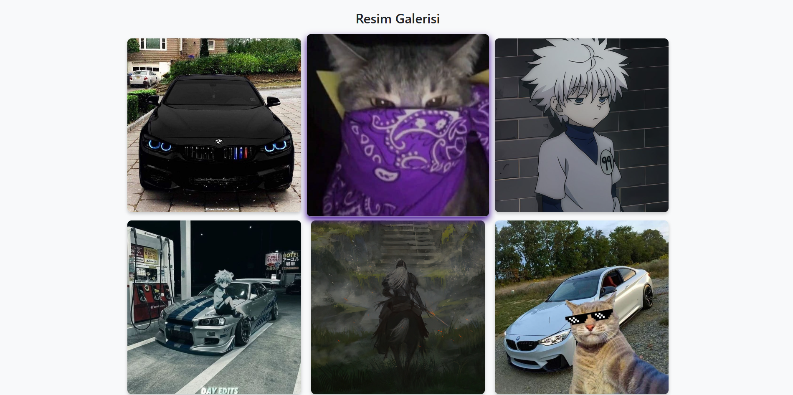
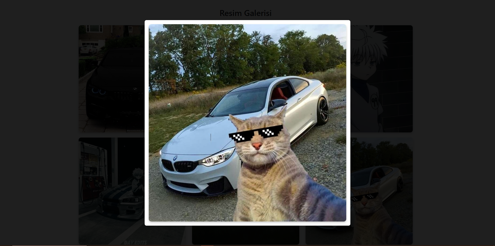

# 🖼️ Resim Galerisi (Bootstrap Modal)

Bu proje, HTML, CSS, JavaScript ve Bootstrap kullanılarak oluşturulmuş bir **resim galerisi uygulamasıdır**.  
Kullanıcılar, küçük resimlere tıkladığında seçilen resim bir **modal pencere** içinde büyük boyutlu olarak gösterilir.

---

## 📸 Ekran Görüntüleri

### 🔳 Galeri Görünümü

### 🔍 Modal Açıldığında

---

## 🚀 Kullanılan Teknolojiler

- HTML
- CSS
- JavaScript
- Bootstrap 5

---

## 🛠️ Özellikler

- Responsive (mobil uyumlu) galeri düzeni
- Resimlere tıklayınca Bootstrap modal ile büyük görünüm
- CSS ile hover efektleri ve görsel iyileştirmeler
- Sabit resim yüksekliği ve grid hizalaması

---
